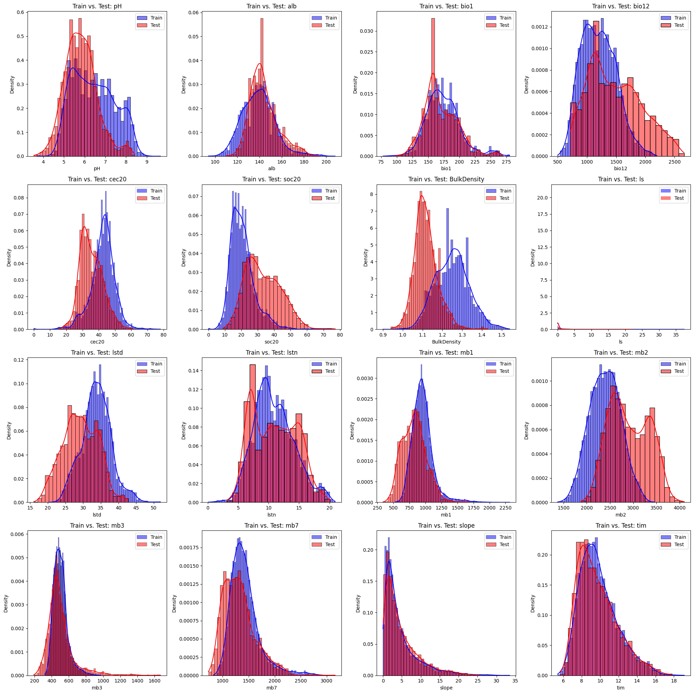

# Amini Soil Prediction Challenge - 13th Place Solution

This repository contains the code for my 13th place finish (Top 10%) in the Amini Soil Prediction Challenge on the Zindi platform. The challenge involved building a model to predict 11 essential soil nutrient gaps for farms across Africa, aiming to empower farmers with data-driven recommendations for a more fertile future.

This solution demonstrates a robust machine learning pipeline that effectively handles complex satellite data and successfully overcomes a significant data shift between the training and test sets.

## The Core Challenge: Overcoming Data Shift

A key difficulty in this competition was the significant distributional drift between the provided training and test data. As shown below, many of the key predictive features had different statistical properties in the test set compared to the training set. A model trained naively on the training data would not generalize well to the test data, leading to poor performance.

*Figure 1: Comparison of feature distributions between the training (blue) and test (red) sets, highlighting a clear data shift.*

## My Winning Strategy

My approach was centered on robust feature engineering and a powerful ensemble modeling strategy, with pseudo-labeling as the decisive technique to bridge the data shift.

### Key Methodological Highlights:

#### Advanced Feature Engineering:

*   **Multi-Source Satellite Data:** Integrated and processed extensive Earth Observation data from Landsat 8, Sentinel-1, Sentinel-2, and various MODIS products.
*   **Temporal Aggregation:** Captured dynamic environmental trends by creating features aggregated over multiple time windows (30, 90, 180, and 365 days).
*   **Interaction Features:** Built features that captured the complex interactions between soil properties (like pH and soc20) and satellite-derived indices (like NDVI).

#### Ensemble Modeling:

To ensure a robust and accurate final prediction, I created a weighted ensemble of three diverse models: LightGBM, XGBoost, and a Tweedie GLM. This approach combines the strengths of different algorithms to improve generalization.

### Pseudo-Labeling: The Key to Success

The critical component of this solution was the use of **Confident Pseudo-Labeling**. This semi-supervised technique was instrumental in mitigating the data shift.

**How it worked:** The model was first trained on the original training data. It then made predictions on the test set, and the most confident of these predictions were selected and added back to the training set as "pseudo-labels." This process was repeated iteratively, allowing the model to safely learn from the test set's distribution and dramatically improving its predictive accuracy on the final leaderboard.
